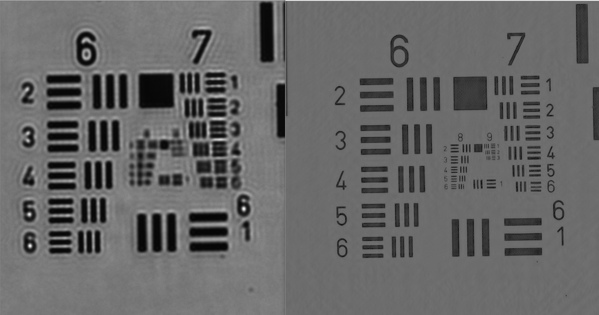
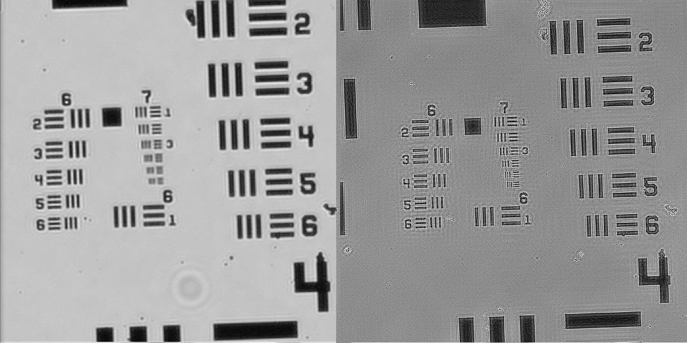

# Fourier Ptycography Project

Link to video demonstration: https://youtu.be/9KJLWwbs_cQ

## Overview

This repository contains code and resources for a Fourier ptycography system, which uses computational imaging to achieve high-resolution microscopy through multiple low-resolution measurements.

## Repository Structure

- **/Arduino** - LED Matrix Control System
  - Ptycography_LED_matrix_program - Control software for the LED matrix
  - Libraries for LED matrix, pattern generation, and camera control

- **/Media** - Example images and MATLAB code
  - Resolution target images
  - Reference implementations
  - Comparison images

## Arduino LED Matrix Controller

The Arduino directory contains a complete system for controlling an LED matrix for Fourier ptycography experiments:

- Modern Processing-based central controller
- Arduino firmware for hardware control
- Camera triggering and synchronization
- Visualization tools

## Example Results

USAF Resolution target comparison from Waller Lab at UCB

My best reconstruction of the USAF target